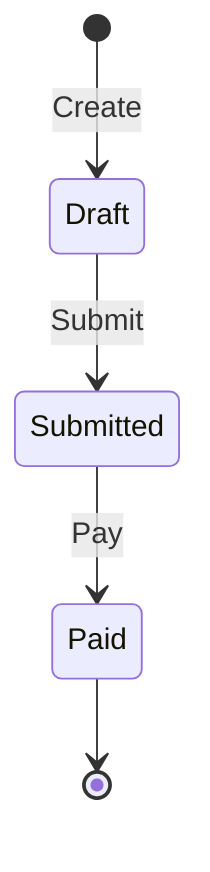

# State Machine Design

Design finite state machines and statecharts for modeling entity lifecycles, workflows, and system behavior. Base all guidance on Harel statechart semantics.

## Core Elements

| Element      | Description                        | Example                          |
|--------------|------------------------------------|----------------------------------|
| State        | Condition the system can be in     | `Draft`, `Submitted`, `Paid`     |
| Transition   | Change from one state to another   | `Draft -> Submitted`             |
| Event        | Trigger for a transition           | `Submit`, `Pay`, `Cancel`        |
| Guard        | Condition that must be true        | `[hasItems]`, `[isValid]`        |
| Action       | Side effect on transition          | `sendNotification`               |
| Entry Action | Action when entering state         | `onEnter: startTimer`            |
| Exit Action  | Action when leaving state          | `onExit: stopTimer`              |

## State Types

| Type       | Symbol             | Purpose                     |
|------------|--------------------|-----------------------------|
| Initial    | Filled circle      | Starting state              |
| Normal     | Rounded rectangle  | Regular state               |
| Final      | Circle with border | End state                   |
| Composite  | Nested region      | Contains sub-states         |
| Parallel   | Dashed regions     | Concurrent activities       |
| History    | H / H*             | Remember last sub-state     |
| Choice     | Diamond            | Decision point              |

## Notation

Use PlantUML or Mermaid for state diagrams. See [references/notation-examples.md](references/notation-examples.md) for full syntax examples with PlantUML and Mermaid.

Quick PlantUML pattern:

```plantuml
[*] --> Draft : Create
Draft --> Submitted : Submit [hasItems]
Submitted --> Paid : Pay [paymentValid]
Paid --> [*]
```

Quick Mermaid pattern:



## Implementation

For XState (TypeScript) implementation patterns, see [references/xstate-patterns.md](references/xstate-patterns.md).

## Design Best Practices

### Naming

- **States as conditions**: `Submitted` not `Submit`
- **Events as commands**: `Submit` not `Submitted`

### State Validation (MANDATORY)

Every proposed state MUST pass these checks. If it fails any, it is a transition or action, not a state.

**The Indefinite Wait Test:** Can the system sit in this state indefinitely, waiting for an external event? If no — it's a transition, not a state.

- `Uninitialized` — Yes, candidate hasn't started. **State.**
- `Initializing` — No, system is doing work that will finish in seconds. **Transition.**
- `Interviewing` — Yes, waiting for candidate messages. **State.**

**The Verb Test:** Is the name a verb or gerund (-ing word describing an activity)? If yes — it's likely a transition. States are conditions (adjectives, past participles, nouns), not activities.

- `Processing` → Transition. What are the states before and after processing?
- `Processed` → State. The system is in the "processed" condition.
- `Evaluating` → Transition. The states are the condition before and after evaluation.
- `Completed` → State. (Past participle describing a condition, not an ongoing activity.)

**The Failure Test:** If this "state" fails partway through, does the system need to resume from a midpoint, or just retry from the previous state? If retry from previous → it's a transition with actions, not a state. If resume from midpoint → consider whether you actually need an intermediate state, or whether making the transition idempotent is sufficient.

**When you think you need an -ing state**, decompose it:
1. Identify the stable state before the activity
2. Identify the stable state after the activity
3. The activity becomes the transition, with actions for the work performed
4. If any action fails, the system stays in the "before" state and the transition can be retried

### Guidelines

1. Use guards for conditional transitions
2. Keep states atomic — one responsibility per state
3. Document entry/exit actions
4. Consider terminal states (final states)
5. Prefer explicit transitions over implicit state changes
6. Validate every state against the three tests above before including it in the machine

### Transition Design

**Prefer idempotent transitions over atomic or intermediate-state approaches.**

Transitions often involve multiple actions (e.g., clone agent, enrich profile, attach memory). When a transition can fail partway through, there are three approaches:

| Approach | How it works | Downside |
|---|---|---|
| Atomic + rollback | If any action fails, undo all prior actions | Rollback code is hard to test and can itself fail |
| Intermediate state | Add a state between "before" and "after" to represent partial progress | Adds permanent complexity for a transient problem; often fails the indefinite wait test |
| **Idempotent (preferred)** | Each action checks "is this already done?" before executing | Simple, retry-safe, no extra states needed |

**Idempotent transition pattern:**
- Each action in the transition is a no-op if its work is already complete
- The full transition can be called multiple times safely — same end result
- On partial failure, retry the whole transition; completed actions are skipped
- No rollback logic needed, no intermediate states needed

**Example:** An `Initialize` transition with actions `[cloneAgent, enrichProfile, attachMemory, sendGreeting]` — if `enrichProfile` fails, retry `Initialize`. `cloneAgent` detects the agent already exists and skips. `enrichProfile` runs again. No extra state required.

### Common Patterns

| Pattern      | Use Case                  |
|--------------|---------------------------|
| Linear       | Simple sequential flow    |
| Choice       | Conditional branching     |
| Parallel     | Concurrent activities     |
| Hierarchical | Complex nested states     |
| History      | Resume from last state    |

## Design Workflow

1. **Identify entity** — What has the lifecycle?
2. **List states** — What conditions can it be in?
3. **Define events** — What triggers state changes?
4. **Map transitions** — State + Event -> New State
5. **Add guards** — What conditions must be true?
6. **Define actions** — What happens on transitions?
7. **Draw diagram** — Visualize for review (PlantUML or Mermaid)
8. **Implement** — Use XState or appropriate pattern
