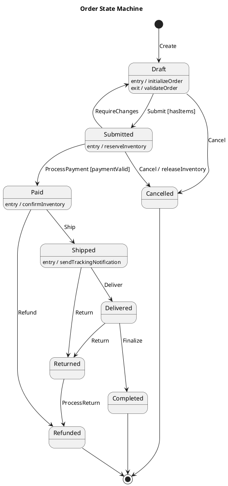
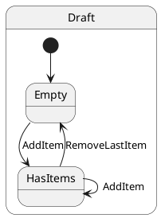
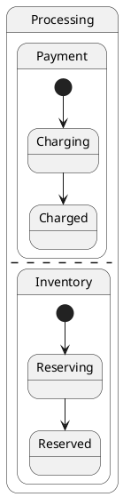
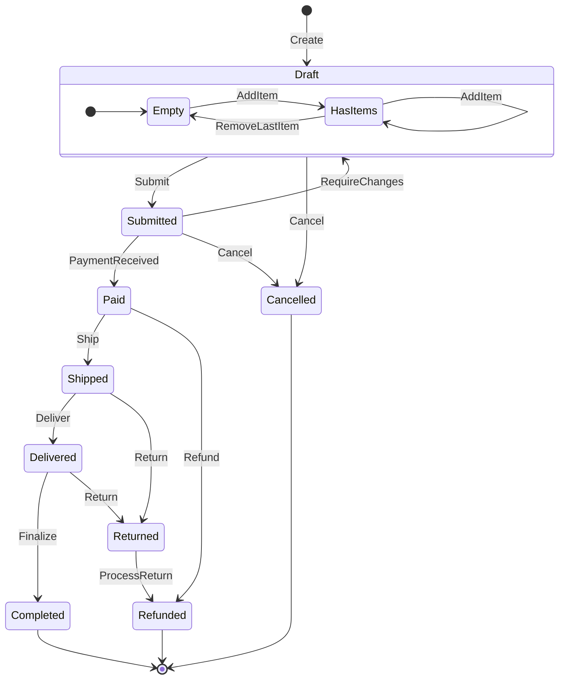
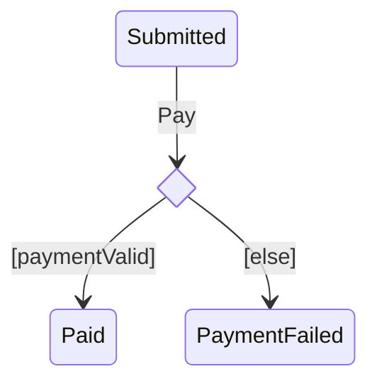

# State Machine Notation Examples

## PlantUML

### Full Example — Order Lifecycle

### Composite State

### Parallel States

## Mermaid

### Full Example — Order Lifecycle

### Choice (Decision) Points

